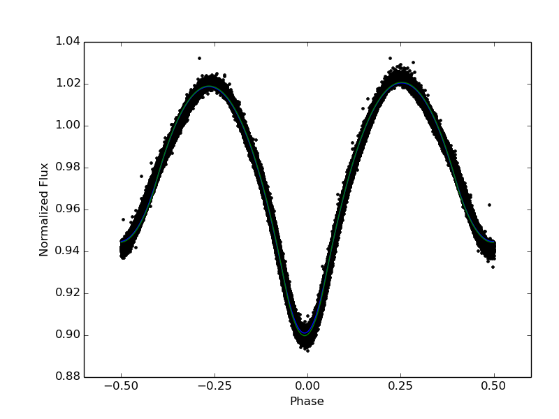

# Finding Planets in the Kepler EB Data

In this project we'll hunt for planets orbiting binary stars using the publicly available Kepler data. We've got the data for __50 eclipsing binary stars__. Some number of these binary stars are known to have planets: _it's up to you to find out which!_

## Read the below for an overview of the science. 

## To get started with the data itself have a look at [this notebook](data_handling.ipynb).

___

# 1. Introduction

### Binary Stars

About half of all stars exist in [_binary star systems_](https://en.wikipedia.org/wiki/Binary_star). These are systems where stars of a similar size and mass orbit very closely around a common centre of mass.

The formation and evolution of a binary system is very complicated and not really worth discussing here. The main thing to note is that planets are just as likely to form around these double stars as they are around single stars like our own

It's these types of planets (called _circumbinary planets_) that we'll be looking for.

The separation of the stars is so small that most of the time binary systems actually just look like a single point of light. There's no way to tell them apart from a single star, except:

### Eclipsing Binaries

If the orbital plane of the two stars is lined up with our line of sight then we'll see the binaries eclipse each other twice per orbit. When each star eclipses the other the light from the system will drop by a small amount.

Monitoring the light from a binary system over a long period of time and looking for eclipses allows us to study these sytems in great depth. The deepest eclipse, where the smaller star blocks the larger one is called the _primary eclipse_ and vice versa for the _secondary eclipse_.

### Eclipse Timing Variations (ETVs)

The two binaries orbit a shared centre of mass. If there is a planet present in the system then the binaries centre of mass will wobble around a point as the small gravitational pull of the planet perturbs it. This perturbation will be very regular and we can measure it by precisely timing the eclipses of the binaries.

As the planet orbits the system, the centre of mass of the binary will be pulled slightly towards the planet. This pull causes the eclipses to happen either slightly further away or slightly closer to us. The effect on the light travel time (typically a few minutes) causes the eclipses to happen either later or earlier than you would expect.

This is called an eclipse timing variation. If these variations are regular or periodic it indicates the presence of a planet.
___

# 2. Method

### Light Curves and Phasing

The __light curve__ is the main way we'll be interacting with these binary systems. Above is an example light curve from one of the systems we'll be studying. This is simply the brightness of the whole system over time. Kepler collected data for thousands of eclipsing binaries by measuring the brightness of the binary system every 29.4 minutes over many years. The full light curves are then long sequences of sometimes sparse data. However, the above light curve has been __phased__. 

Phasing simply takes each data point (29.4 mins apart) and figures out where __in the orbital period__ the system was in that time. The orbits of the binaries we'll use are all between 6 hours and 18 hours. The _phase_ is defined as a number from -0.5 to 0.5 with the primary eclipse occuring at 0.0 (secondary eclipse then at -0.5 and 0.5).

### Eclipse Timing

To properly phase the light curve we need to know the period very precisely. Checking the phased curve is then the best way to see if your period measurement is correct. To make precise eclipse timings we need to know: 1. the period of the system very precisely, 2. the time of the first eclipse very precisely.

If we know these two things we can predict the time of each eclipse and see how far off the real eclipse was. This amount is the ETV (measured in minutes). We then plot the ETVs with time and look for a pattern. The pattern will tell you if there is a planet or not.

___

# 3. Project Suggestions

These are my _suggested_ steps for the project to see if we can find some planets. We might not get that far or might do something else but this is a rough idea:

1. Come up with a method for precisely measuring the orbital period of the binary systems. Whatever this is will probably also allow you to precisely measure the time of each eclipse. If we want to detect the presence of a planet we need this to be accurate to within a few minutes.
2. Use the _measured_ period to predict eclipse times for each system.
3. Compare the predicted eclipse times to the measured eclipse times and plot the difference over time.
4. From the plot, see if you can see a pattern (should look almost sinusoidal). If the pattern is there then it indicates the presence of a planet.
5. Repeat on all systems and make a guess as to which have planets and which don't.
6. Compare this to the master list which I'll keep and see what % correct you are. We can refine the method after this stage to improve your predictions.
